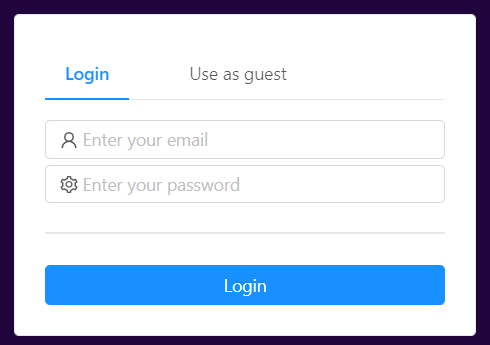
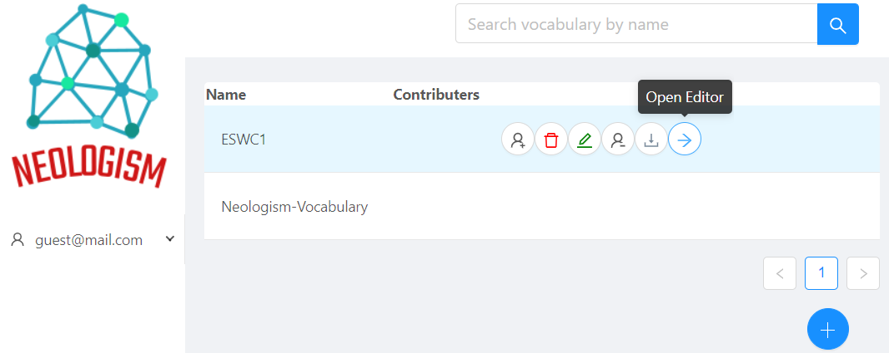
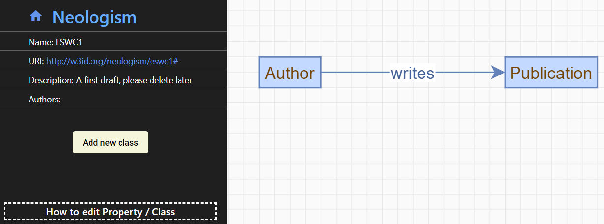
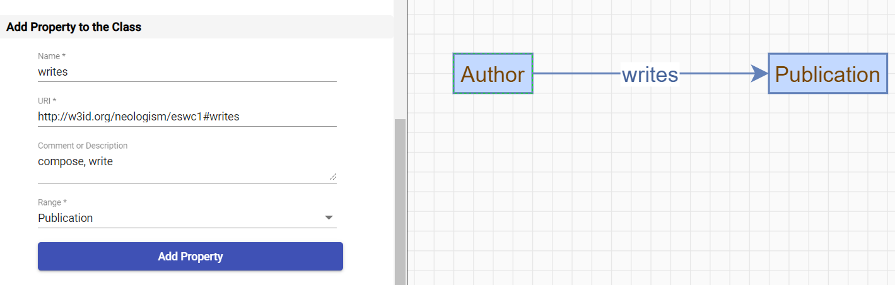
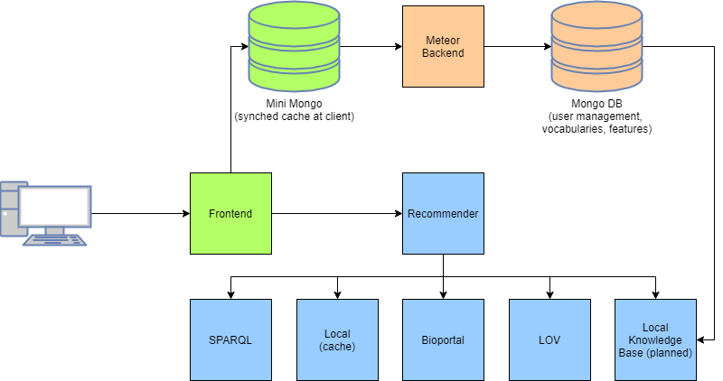

# Neologism 2.0

Neologism 2.0 is an open-source tool for quick vocabulary creation through domain experts.
Its guided vocabulary creation and its collaborative graph editor enable the quick creation of proper vocabularies, even for non-experts, and dramatically reduces the time and effort to draft vocabularies collaboratively.
An RDF export allows quick bootstrapping of any other Semantic Web tool.


## Usage (Live Demo)

We provide a [live demo version](http://cloud33.dbis.rwth-aachen.de/dashboard) of Neologism 2.0, which can be used as a guest without registration.
Additionally, [this short video](https://owncloud.fraunhofer.de/index.php/s/V96LKrLRZ0NvTW3) shows the vocabulary creation process, but does not include the RDF export.



The dashboard shows all created vocabularies and allows creating, editing, deleting, and exporting vocabularies.
Please note that the guest account can only create 10 vocabularies to reduce database load.



A graphical editor helps users creating vocabularies visually in an interactive mode.
Note that all ontology URIs (identifiers) are automatically created for simplicity and user convenience.



Clicking on nodes (classes) allows creating properties between classes.



An RDF (turtle) export allows quick bootstrapping of any other Semantic Web tool.
We suggest using Neologism 2.0 for creating early vocabulary drafts and importing its RDF export into Protégé for subsequent refinements by Semantic Web experts, which can finally yield fully-featured ontologies.

## Architecture Overview

Neologism 2.0’s frontend communicates with a backend to persist information,
and might interact with a recommender to improve the quality of drafted vocabularies.



## Installation

__Easy usage via Docker:__
1.  Navigate to frontend/
2. `docker-compose build`
3. `docker-compose up`

__Local setup:__
1. Clone the repository
2. Install meteor using curl https://install.meteor.com/ | sh
3. Install node version to 12.20.1 with compatible npm
4. Install /Download nginx for CORS (Linux: `sudo apt-get install nginx` Arch: `sudo pacman -S nginx` Windows: http://nginx.org/en/docs/windows.html) (On Windows move the folder to C:\)
5. Create a `sites-enabled` folder inside the nginx folder (Linux: /etc/nginx/sites-enabled).
6. Put the `neologism.com` file inside this folder.
7. Edit the `nginx.conf` file by including the path of the sites-enabled folder. For Windows the path to the .com file: 

```
{
http {
    include       mime.types;
    default_type  application/octet-stream;
	include 	"C:/nginx-1.19.6/sites-enabled/neologism.com";
	...
}

```
8. Run `npm i` in the frontend subfolder
9. Run `npm i` in frontend/api
10. Run `npm run meteor-client:bundle` in the frontend subfolder
11. Navigate to frontend
12. Run `npm run api` to start a local meteor server (running on http://localhost:3000/ with a connection to a local mongodb at port 3001).
13. Run `npm run start` for a dev server. Navigate to http://localhost:4200/. The app will automatically reload if you change any of the source files.
14. Optional: If you need to run the recommender, install an AddOn for your browser to allow CORS, as configurations need to be done


__DISCLAIMER:__
Steps above are valid to run in Ubuntu focal

__NOTE:__
- Initially & every time you make a change to the server code (which affects the client side code), rebundle the meteor client side code by running `npm run meteor-client:bundle`.
- Find more details for the Angular/Meteor integration here: https://github.com/Urigo/angular-meteor/tree/master/examples/AngularCLI


__Major Versions:__
- Angular 9
- Meteor 1.12
- Node 12.20.0

__Troubleshooting:__
- check if node version compatibility for front and api
- run `meteor npm -v` or `meteor node -v`

## Technical Workflow
After starting Neologism, navigate to `localhost` (or whatever server you are hosting it on), and follow the user interface.

## MongoDB Schema

### Class (classes)
```
{
   "_id":"autogenerated",
   "name":"string",
   "description":"string",
   "URI":"string",
   "properties":[
      "property_id"
   ],
   "position":{
      "x":"number",
      "y":"number"
   },
   "skos":{
      "closeMatch":[

      ],
      "exactMatch":[

      ]
   }
}
```

### Property (properties)
```
{
   "_id":"autogenerated",
   "name":"string",
   "description":"string",
   "URI":"string",
   "range":"class_id"
}
```
### Vocabulary (vocabularies)
```
{
   "_id":"autogenerated",
   "name":"string",
   "description":"string",
   "URI":"string",
   "properties":[
        "property_id"
   ],
   "position":{
      "x":"number",
      "y":"number"
   },
   "skos":{
      "closeMatch":[

      ],
      "exactMatch":[

      ]
   }
}
```
### User (users)
```
{
   "_id":"autogenerated",
   "createdAt":{
      "$date":"ISODate"
   },
   "services":{
      "password":{
         "bcrypt":"autogenerated"
      },
      "resume":{
         "loginTokens":[
            {
               "when":{
                  "$date":"ISODate"
               },
               "hashedToken":"autogenerated"
            },
            {
               "when":{
                  "$date":"ISODate"
               },
               "hashedToken":"autogenerated="
            }
         ]
      }
   },
   "emails":[
      {
         "address":"string@email",
         "verified":"boolean"
      }
   ]
}
```

# How to cite

We are currently preparing a scientific paper for a peer-reviewed publication. Please refer to [references.bib](references.bib) for BibTex references, which we will update continuously.
